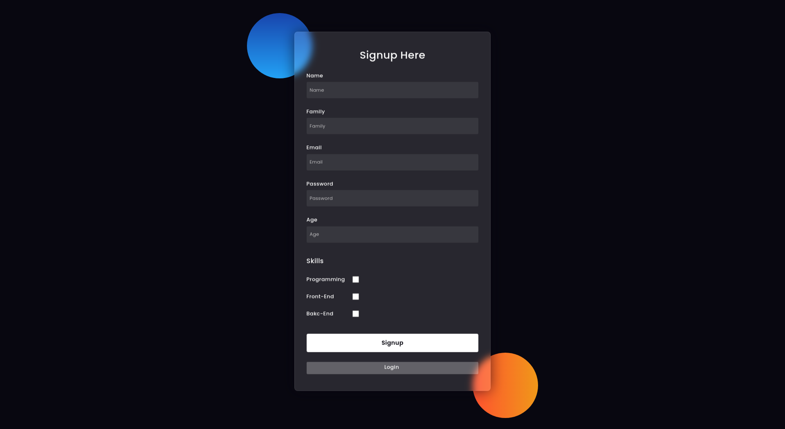

# Rest/MVC Login/Signup Expressjs , Nodejs , MongoDB

A Simple Login & Signup app Using Epxressjs , Nodejs , MongoDB based on MVC & Rest

 
 

- [x] Nodejs
- [x] Expressjs
- [x] MongoDB
- [x] Google Font API
- [x] Restful API
- [x] MVC
- [x] ES6 linting with continuous linting on file change

## Starting the dev server

Make sure you have the latest Stable or LTS version of Node.js installed.

1. `git clone https://github.com/am-abazari/MongoDB-Expressjs-Nodejs-Login-Signup.git`
2. cd `MongoDB-Expressjs-Nodejs-Login-Signup`
3. Enable MongoDB
4. `npm install`
5. `npm start`
6.  Open [http://localhost:4000/](http://localhost:4000/)

## Available Commands

- `npm start` - start the dev server
- `nodemon app.js` - start the dev server

## Code Coverage

The project is using the <strong>Expressjs - Nodejs - MongoDB</strong>. All configurations are located in `package.json`

## About Author

<strong>Amirhossein Abazari</strong> Full-Stack Web Developer
